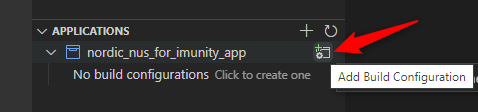
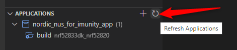

# Immunity Firmware
[]()
[]()
[]()

This firmware project is made as counterpart to the Immunity App. It uses the Nordic UART Service (NUS) to receive data and directly mirroring it back to the sender.

## Installation
1. Install [Visual Studio Code](https://code.visualstudio.com/) (VS Code)
2. Open VS Code
3. Open the "Extensions" menu - using the icon in the left vertical menu bar or by pressing CTRL+SHIFT+X
4. Search and start installation of the "nRF Connect Extension Pack" extension. 
5. Install [nRF Connect for Desktop](https://www.nordicsemi.com/Products/Development-tools/nrf-connect-for-desktop/)
6. Open nRF Connect for Desktop
7. In the Apps part install and open "Toolchain Manager"
8. In the Toolchain Manager install current nRF Connect SDK
9. Clone this repository with
   ```
   git clone https://github.com/panasonic-industry-europe/immunity_firmware.git
   ```
10. Open the created folder with VS Code.
11. VS Code will ask if the project should be added to the list of visible applications. Select Yes. Please note that this question will disappear after a few seconds. If you miss to click on yes in time you have to close VS Code and open the project again to trigger this dialog again.
12. VS Code will ask for an installation of nRF Connect SDK. Click on "Select" and select your nRF Connect SDK version.
13. VS Code will ask for a toolchain installation. Click on Select and chose the version you are using.
14. Open the "nRF Connect" menu - using the icon in the left vertical menu bar or by pressing CTRL+ALT+N
15. In the "Applications" menu click on "Add Build Configuration"
    
    

16. A form will open where the board configuration can be selected. Following Options can be selected depending of which Bluetooth module should be used:
    -   PAN1780: nrf52840dk_nrf52840
    -   PAN1781: nrf52833dk_nrf52820
    -   PAN1782: nrf52833dk_nrf52833
17. Click on "Generate Config". Now all dependencies will be setup and the project is ready for build, flash and debug tasks.

## Building the Application
1. Open the "nRF Connect" menu - using the icon in the left vertical menu bar or by pressing CTRL+ALT+N
2. In the "ACTIONS" menu click on build
3. After build the result is available under /build/zephyr/zephyr.bin

## Flashing the Application
1. Connect the Bluetooth Module to a debugger.
2. Open the "nRF Connect" menu - using the icon in the left vertical menu bar or by pressing CTRL+ALT+N
3. In the "ACTIONS" menu click on "Flash" or "Erase and Flash". If these actions are not visible click on the "Refresh Applications" icon in the "APPLICATIONS" menu.

    